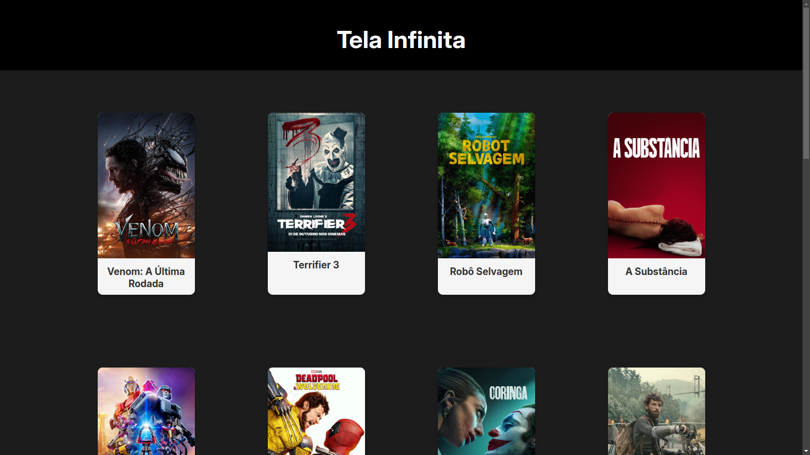

# Tela infinita

**Tela Infinita** E um site para exibir informações do site.

## Recursos

- Mostra os flimes que estão em alta no momento, com os detalhes do filmes como sinopse, popularirade e data de lançamento.
- Interface simples e intuitiva.
- Com layout responsivo para diferentes tamanhos de tela.

## Tecnologias Usadas

- **HTML5** e **CSS#** para a estrutura e design do projeto.
- **JavaScript** e **Typescript** para a manipulação de dados e interatividade.
- **API TMDB** para coletar as informações dos filmes.

## Para clonar o projeto

**Pre requisitos**

Certifique-se de ter o NodeJs e npm na sua maquina, Comando para verificar: 

`node -v`
`npm -v`

**Instalar as dependências**

Para instalar as dependências do projeto.

`npm install`

**Para rodar o projeto**

`npm run start`

O site estará acessível em: http://localhost:3000/